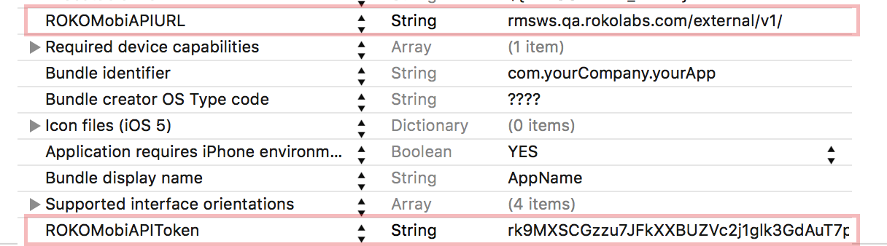

# Roko Mobi iOS

[](http://cocoapods.org/pods/ROKO.Mobi) [](http://cocoapods.org/pods/ROKO.Mobi)

*This is a repository of all ROKO Mobi open source iOS SDKs. The information below should serve as a usage guide for our iOS SDKs. See the table of contents below for a complete list of the content featured in this document.*

|Table of Contents|
-------------------
|[Get Our Demo Apps][demoapps]|
|[Roko Stickers][stickers]|
|[Roko Share][share]|
|[Roko Push][push]|
|[Roko Analytics][analytics]|
|[Roko Promo][promo]|

[demoapps]: #get-our-demo-apps
[stickers]: #rokostickers-usage-guide
[share]: #rokoshare-usage-guide
[push]: #rokopush-usage-guide
[analytics]: #rokoanalytics-usage-guide
[promo]: #rokopromo-usage-guide

##Get our Demo Apps 

ROKO has showcased many of our components in Demo Apps on the App Store. Check out our demo, <a href="https://itunes.apple.com/sb/app/roko-stickers/id980258381?mt=8" target="_blank">Roko Stickers</a>, which includes the Stickers and Share SDKs, on the Apple App store.

## ROKOStickers Usage Guide

The ROKOStickers framework provides a means for taking photos, dressing them up in stickers, and sharing the results with the world through FB, Twitter, e-mail, or sms.

### Prerequisites

1) ROKOStickers framework requires iOS 8.0 or later.

2) Install Xcode 6.0 or later.

###Configure your Xcode Project

There are two ways to configure Xcode project: manual and via Cocoapods.

#### Cocoapods
Add the following line to your pod file:
```
pod "ROKO.Mobi"
```
and run 
```
$ pod install
````
in your project directory

#### Manual

1) Drag and drop Framework files:

```
ROKOMobi.framework
```

into your Xcode project (select "Create groups for any added folders" if needed). These packages contain the static libraries, header files, and necessary resources (configuration files and images).

---

2) Check the following frameworks within the "Link Binary With Libraries" build phase of your project’s target: 

```
ROKOMobi.framework 
UIKit.framework 
Foundation.framework
```

---

3) Include the following line to make the Framework available to your code:

```
#import <ROKOMobi/ROKOMobi.h>
```

---

###Creating photos with ROKOStickers


Figure #1. ROKOStickers WORKFLOW

The code examples in this page demonstrate how to fine-tune and display the photo composer, as well as customize it with your own branded sticker packs.
Integrating ROKOStickers you may choose among several starting points:

####1) Display the View Controller

* User can take a new photo by invoking the camera
* Or user can get images from their camera roll using the Image Picker

On your view add two buttons (call it takePhotoButton and choosePhotoButton). Then connect them with apporopriate functions in your viewcontroller. And set self as datasource delegate if using local stickers (or another datasource if using internet stickers - this example descibes later).


Use kRLComposerWorkflowTypeCamera - to start with Screen 1a. Camera View (Figure #1).

```Objective-C
- (IBAction)takePhotoButtonPressed:(UIButton *)sender {
	RLComposerWorkflowController *workflowController = [RLComposerWorkflowController buildComposerWorkflowWithType:kRLComposerWorkflowTypeCamera useROKOCMS:NO];

	if (nil != workflowController) {
		workflowController.composer.dataSource = self;
		workflowController.composer.delegate = self;
		[self presentViewController:workflowController animated:YES completion:nil];
	}
}
```

Use kRLComposerWorkflowTypePhotoPicker - to start with Screen 1b. Image Picker (Figure #1)

```Objective-C
- (IBAction)choosePhotoButtonPressed:(UIButton *)sender {
	RLComposerWorkflowController *workflowController = [RLComposerWorkflowController buildComposerWorkflowWithType:kRLComposerWorkflowTypePhotoPicker useROKOCMS:NO];

	if (nil != workflowController) {
		RLPhotoComposerController *photoComposer = workflowController.composer;
		photoComposer.delegate = self;
		photoComposer.dataSource = self;

		[self presentViewController:workflowController animated:YES completion:nil];
	}
}
```

####2) Configure ROKOStickers' behavior & content:


You may chose to register your project on ROKO Mobi Portal, which provides easy-to-use GUI, or to configure the ROKOStickers framework and manage it’s content. If you do so, you may skip the following section. Alternatively you may chose to manage the ROKOStickers independently, in this case the following section is a guide for you.

#####a) Customize Composer View appearance.

Add instance variable at you viewcontroller

```Objective-C
@interface ViewController () {
	ROKOStickersScheme *_scheme;
}

```

Customize your own vision of appearance

```Objective-C
- (void)viewDidLoad {
	[super viewDidLoad];
	_scheme = [self createScheme];
}

- (ROKOStickersScheme *)createScheme {
	ROKONavigationBarScheme *naviScheme = [ROKONavigationBarScheme new];
	naviScheme.controllerTitle = @"Stickers";
	naviScheme.useTextButtons = YES;
	naviScheme.navigationLeftButtonText = @"back";
	naviScheme.navigationRightButtonText = @"next";
	naviScheme.navigationBarColor = [UIColor whiteColor];

	ROKOStickersTrayScheme *trayScheme = [ROKOStickersTrayScheme new];
	trayScheme.displayType = ROKOStickersTrayDisplayTypeIconOnly;
	trayScheme.backgroundColor = [[UIColor alloc] initWithWhite:1 alpha:0.5];

	ROKOStickersScheme *scheme = [ROKOStickersScheme new];
	scheme.configurationViaPortal = NO;
    scheme.albumName = @"ROKO Strik";
	scheme.navigationBarScheme = naviScheme;
	scheme.trayScheme = trayScheme;
	return scheme;
}
```

Apply your scheme at willAppear callback - 

```Objective-C
- (void)composer:(RLPhotoComposerController *)composer willAppearAnimated:(BOOL)animated {
	if (_scheme) {
		composer.scheme = _scheme;
	}
}
```

#####b) provide sticker packs content from local resources:

Create sticker packs for local resources. Make sure you add Resource directory to your project. Start with declaration of stickers collection add 2 ivars:


```Objective-C
@interface ViewController () {
	NSArray *_stickerPacks;
	NSDictionary *_stickerPackToIconsCount;
}
```

Fill content to stickers collection

```Objective-C
- (void)viewDidLoad {
	[super viewDidLoad];

	_stickerPackToIconsCount = @{ @"glasses" : @10, @"hats" : @9, @"mustaches" : @9, @"baby" : @22,
		                         @"cake" : @9, @"cat" : @12, @"emoji" : @18, @"wedding" : @12 };

	NSMutableArray *mutableArray = [[NSMutableArray alloc] initWithCapacity:_stickerPackToIconsCount.allKeys.count];
	for (NSString *key in _stickerPackToIconsCount.allKeys) {
		[mutableArray addObject:[self getStickerPack:key]];
	}
	_stickerPacks = [mutableArray copy];
}

- (RLStickerPackInfo *)getStickerPack:(NSString *)packName {
	RLStickerPackInfo *packInfo = [RLStickerPackInfo new];
	packInfo.title = packName;
	packInfo.iconDefault = [UIImage imageNamed:[NSString stringWithFormat:@"%@_icon_default", packName]];
	packInfo.iconSelected = [UIImage imageNamed:[NSString stringWithFormat:@"%@_icon_selected", packName]];
	packInfo.isLocked = NO;

	NSNumber *iconsCount = [_stickerPackToIconsCount objectForKey:packName];
	if (iconsCount) {
		NSInteger count = [iconsCount integerValue];
		NSMutableArray *mutableArray = [[NSMutableArray alloc] initWithCapacity:count];
		for (NSInteger i = 0; i < count; ++i) {
			RLStickerInfo *info = [self stickerInfoWithIndex:i packName:packName];
			[mutableArray addObject:info];
		}
		packInfo.stickers = [mutableArray copy];
	}
	return packInfo;
}
```

Implement RLPhotoComposerDataSource protocol in your viewcontroller. Start with interface.

```Objective-C
@interface ViewController : UIViewController <RLPhotoComposerDataSource>
@end
```

Set *self* as a "dataSource" of the "composer" property of RLComposerWorkflowController.

```Objective-C
RLPhotoComposerController *photoComposer = workflowController.composer;
photoComposer.dataSource = self;
```

Then implement data source methods.

```Objective-C
- (NSInteger)numberOfStickerPacksInComposer:(RLPhotoComposerController *)composer {
	return [_stickerPacks count];
}
// return the number of sticker packs to display on Stickers Selector (Figure #1)


- (NSInteger)numberOfStickersInPackAtIndex:(NSInteger)packIndex composer:(RLPhotoComposerController *)composer {
	RLStickerPackInfo *pack = _stickerPacks[packIndex];
	return [pack.stickers count];
}
// return the number of stickers per each packs

- (RLStickerPackInfo *)composer:(RLPhotoComposerController *)composer infoForStickerPackAtIndex:(NSInteger)packIndex {
	return _stickerPacks[packIndex];
}
// return info for each sticker pack

- (RLStickerInfo *)composer:(RLPhotoComposerController *)composer infoForStickerAtIndex:(NSInteger)stickerIndex packIndex:(NSInteger)packIndex {
	RLStickerPackInfo *pack = _stickerPacks[packIndex];
	RLStickerInfo *info = pack.stickers[stickerIndex];
	return info;
}
// return info for each sticker
```

#####c) Provide sticker packs content from ROKO Portal:

Start with creation two strings on yout .plist.

|Key|Value|
---|---
|ROKOMobiAPIURL|rmsws.stage.rokolabs.com/external/v1|
|ROKOMobiAPIToken|<a href="https://portal.roko.mobi/settings" target="_blank">%YOUR_API_FROM_SERVER%</a>|

Declare and initialize instance variable dataSource :

```Objective-C
@interface ViewController () {
	ROKOPortalStickersDataSource *_dataSource;
}

- (void)viewDidLoad {
_dataSource = [[ROKOPortalStickersDataSource alloc]init];
    	_scheme = [self createScheme];
}
```

Set composer datasource and refresh stickers list.


```Objective-C
- (IBAction)choosePhotoButtonPressed:(UIButton *)sender {
	RLComposerWorkflowController *workflowController = [RLComposerWorkflowController buildComposerWorkflowWithType:kRLComposerWorkflowTypePhotoPicker useROKOCMS:NO];

    if (nil != workflowController) {
        workflowController.composer.dataSource = _dataSource;
        [self loadStickersForController:workflowController];
        workflowController.composer.delegate = self;
        [self presentViewController:workflowController animated:YES completion:nil];
    }
}

- (void)loadStickersForController:(RLComposerWorkflowController *)controller {
    __weak RLPhotoComposerController *composer = controller.composer;
    [_dataSource reloadStickersWithCompletionBlock:^(id responseObject, NSError *error) {
        [composer reloadData];
    }];
}
```

#####d) Provide watermark to display on photo

User can add watermark to image when user starts using some sticker pack, for example for “wedding” sticker pack. After filling sticker collection add this code:

```Objective-C
- (void)addWatermarkToWeddingStickerPack {
	for (RLStickerPackInfo *stickerPack in _stickerPacks) {
		if ([stickerPack.title isEqualToString:@"wedding"]) {
			RLWatermarkInfo *info = [RLWatermarkInfo new];
			info.icon = [UIImage imageNamed:@"watermark_3"];
			info.position = kRLWatermarkPositionBottomRight;
			stickerPack.watermarkInfo = info;
		}
	}
}
```

It’s automatically add watermark when using at least one sticker form “wedding” pack.

Even user can add watermark to whole image using composer

```Objective-C
RLWatermarkInfo *watermark = [RLWatermarkInfo new];
watermark.icon = [UIImage imageNamed:@"watermark_3"];
watermark.position = kRLWatermarkPositionBottomRight;

RLPhotoComposerController *photoComposer = workflowController.composer;
photoComposer.dataSource = self;
photoComposer.projectWatermark = watermark;
```

Note:

1) you may choose among a variety of options to place the watermark on screen:

```
kRLWatermarkPositionTopLeft, 
kRLWatermarkPositionTop, 
kRLWatermarkPositionTopRight, 
kRLWatermarkPositionLeft, 
kRLWatermarkPositionCenter, 
kRLWatermarkPositionRight, 
kRLWatermarkPositionBottomLeft, 
kRLWatermarkPositionBottom, 
kRLWatermarkPositionBottomRight 
kRLWatermarkPositionFullScreen 
```

2) you may provide scale factor for the watermark from 0.1 to 1. Default is 1.

#####e) Further customization:

Display sticker packs as:

```
ROKOStickersTrayDisplayTypeIconOnly,
ROKOStickersTrayDisplayTypeTitleOnly,
ROKOStickersTrayDisplayTypeTitleAndIcon
```


Use

```Objective-C
ROKOStickersTrayScheme *trayScheme = [ROKOStickersTrayScheme new];
	trayScheme.displayType = ROKOStickersTrayDisplayTypeIconOnly;
```

##ROKOShare Usage Guide

###Before You Begin:

1) ROKOMobi framework requires iOS 7.0 or later.

2) Install Xcode 6.0 or later.

3) ROKOShare framework supports both iPhone and iPad user interface.

###Configure Your Xcode Project:

####1) Add Files

Copy the ROKOMobi.framework and ROKOMobiResources.bundle into your project (select "Create groups for any added folders" if needed). These packages contain the static library, header files, and necessary resources (configuration files and images).

####2) Add the following frameworks within the "Link Binary With Libraries" build phase of your project’s target:

```
ROKOMobi.framework
Social.framework
MessageUI.framework
ImageIO.framework
CoreLocation.framework
QuartzCore.framework
UIKit.framework
Foundation.framework
```

####3) Make sure ROKOShare.bundle is included in your target's "Copy Bundle Resources" build phase.

####4) Generate the API Token by registering your project on ROKO Mobi Portal. Add «ROKOMobiAPIToken» key to your Xcode project’s info.plist and set the generated API Token as it’s value



####5) Include the following line to make the Framework available to your code:

```Objective-C
#import <ROKOMobi/ROKOMobi.h>
```

###Sharing Content with ROKOShare

The ROKOShare framework provides a means to share rich content from your app into the sms, e-mail, Twitter, and Facebook, including text, photos, and URL attachments. The code examples in this page demonstrate how to customize and display the sharing dialog, as well be informed about posting results within your app.

####1) Display the View Controller

To integrate ROKOShare in your application, create an instance of RSActivityViewController and present in on screen:

```Objective-C
- (void)showROKOShare{
RSActivityViewController *controller = [RSActivityViewController buildController];
self.modalPresentationStyle = UIModalPresentationCurrentContext;
[self presentViewController:controller
                  animated:YES
                completion:^{
   self.modalPresentationStyle = UIModalPresentationFullScreen;
}];
}
```

Note: UIModalPresentationCurrentContext must be applied to your window’s rootViewController, i.e. if your view controller is embedded into UINavigationController, then UIModalPresentationCurrentContext must be applied to UINavigationController:

```Objective-C
  self.navigationController.modalPresentationStyle = UIModalPresentationCurrentContext;
```

####2) Provide the subject, message, image, video, and/or URL to be shared:

```Objective-C
- (void)showROKOShare
{
	RSActivityViewController *controller = [RSActivityViewController buildController];
	controller.displayMessage = @"Sample text to be shared with image and video";
	NSString *videoPath = [[NSBundle mainBundle] pathForResource:@"path_to_video_file" ofType:@"mov"];
	controller.videoData = [[NSData alloc] initWithContentsOfFile:videoPath];
	controller.image = [UIImage imageNamed:@"imagesample.jpeg"];
	controller.URL = [NSURL URLWithString:@"http://rokolabs.com"];
}
```
Note: ROKOShare framework offers the option of using two different messages: 

- display message: to be displayed in the view controller’s «Message View» (please refer to the image in «Customize ROKOShare appearance» section), set via addDisplayMessage:

- share message: to be actually shared via social services, set via addShareMessage:.

This option will only work if the «Message View» is not be editable (which is default).
Please follow «Customizing ROKOShare appearance» section to get to know how to make the MessageView editable. 

####3) Detect that the post was shared successfully from your app

a) Declare that your view controller implements the RSActivityViewControllerDelegate protocol:

```Objective-C
@interface MyViewController : UIViewController <RSActivityViewControllerDelegate> 
```

b) Before you present the instance of RSActivityViewController, set your

```Objective-C
RSActivityViewController’s delegate:
controller.delegate = self;
```

c) Implement delegate’s methods:

```Objective-C
- (void)activityControllerDidCancel:(RSActivityViewController *)controller
{
   NSLog(@"CANCEL BUTTON PRESSED");
}
- (void)activityController:(RSActivityViewController *)controller
didFinishWithActivityType:(RSActivityType)activityType result:
(RSActivityViewControllerResult)result
{
   switch (result) {
       case kRSActivityViewControllerResultCancelled:
           NSLog(@"SHARING CANCELLED");
           break;
       case kRSActivityViewControllerResultFailed:
           NSLog(@"SHARING FAILED");
           break;
       case kRSActivityViewControllerResultDone:
           NSLog(@"SHARED SUCCESSFULLY");
           break;
       default:
break; 
}
}
```

###Customizing ROKOShare Appearance:

ROKOShare appearance is highly customizable. 


There are two ways to customize standard view: 

- use ROKO Mobi portal where you could customize view in friendly interface

- transform the standard view to a custom one with just a few lines of code

If you are using ROKO Mobi Portal to customize ROKOShare, all you need is login to the portal, go to the **Share - Settings** section and tune view appearence on your taste. 


In this case you may skip the following sections

###Customizing view from your code

####1) Customizing «Background View»:

You may change: - background color; 
To do that implement the following code:

```Objective-C
controller.shouldLoadSchemeFromPortal = NO;   //configure scheme locally
ROKOShareScheme* scheme =  [[ROKOShareScheme alloc]init];
scheme.backgroundColor = [UIColor greenColor];
controller.shareScheme = scheme; // apply local scheme to the controller
```

####2) Customizing «Prompt View»:

You may change: - text color - font - title
To do that implement the following code:

```Objective-C
scheme.preivewScheme = [[ROKOSharePreviewScheme alloc]init];
scheme.preivewScheme.promptText = @"Custom prompt text";
scheme.preivewScheme.promptTextFont = [[ROKOFontDataObject alloc]init];
scheme.preivewScheme.promptTextFont.name = @"Georgia";
scheme.preivewScheme.promptTextFont.size = @32;
scheme.preivewScheme.promptTextFont.color = [UIColor redColor];
```

####3) Customizing «Message View»:

You may change: - text color - font - text  

```Objective-C
scheme.preivewScheme.useStaticMode = YES;
scheme.preivewScheme.staticText = @"Custom static text";
scheme.preivewScheme.staticTextFont = [[ROKOFontDataObject alloc]init];
scheme.preivewScheme.staticTextFont.name = @"Georgia";
scheme.preivewScheme.staticTextFont.size = @16;
scheme.preivewScheme.staticTextFont.color = [UIColor redColor];
```

####4) Customizing «Close Button» & «Cancel Button»:

You may provide the following parameters specifically for 

- text color 
- title
- image
- font

To do that implement the code below. Please note that the same code applies to «Cancel Button» To do that implement the following code:

```Objective-C
scheme.navigationScheme = [[ROKOShareNavigationScheme alloc] init];
scheme.navigationScheme.useTextForCloseButton = YES;
scheme.navigationScheme.closeButtonEnabled = YES;
scheme.navigationScheme.closeButtonText = @"CLOSE";
scheme.navigationScheme.closeButtonTextFont.name = @"Georgia";
scheme.navigationScheme.closeButtonTextFont.size = @16;
scheme.navigationScheme.closeButtonTextFont.color = [UIColor yellowColor];
scheme.navigationScheme.doneButtonEnabled = YES;
scheme.navigationScheme.useTextForDoneButton = NO;
ROKOImageDataObject* imageDataObject = [[ROKOImageDataObject alloc]init];
imageDataObject.image = [UIImage imageNamed:@"close"];
scheme.navigationScheme.doneButtonImageFile = imageDataObject;
```

####5) Customize sharing services:

You may change:
- the order the services are displayed on screen
- image for each service

```Objective-C
ROKOShareChannelScheme * twitterChannel = [[ROKOShareChannelScheme alloc]init];
twitterChannel.type = kRSActivityTypeTwitter;
twitterChannel.enabled = YES;
twitterChannel.bodyText = @"shared in twitter";
ROKOImageDataObject* twitterImage = [[ROKOImageDataObject alloc]init];
twitterImage.image = [UIImage imageNamed:@"twitter"];
ROKOShareChannelScheme * facebookChannel = [[ROKOShareChannelScheme alloc]init];
twitterChannel.type = kRSActivityTypeFacebook;
twitterChannel.enabled = YES;
twitterChannel.bodyText = @"shared in facebook";
ROKOImageDataObject* facebookImage = [[ROKOImageDataObject alloc]init];
facebookImage.image = [UIImage imageNamed:@"facebook"];
scheme.channels = @[twitterChannel,facebookChannel];
```
## ROKOPush Usage guide

ROKOPush is a simple component that allows you to handle Push Notifications.

### Subscribe to push notifications from ROKO Portal

Call registerWithAPNToken: method of ROKOPush class to begin receiving notifications generated by ROKO Portal. The only parameter is the token that identifies the device to APNs. The following example shows how to use this method:
```Objective-C
#import <UIKit/UIKit.h>
#import <ROKOMobi/ROKOMobi.h>

@interface AppDelegate : UIResponder <UIApplicationDelegate>

@property (strong, nonatomic) UIWindow *window;
@property (nonatomic, strong) ROKOPush *pushComponent;

@end

@implementation AppDelegate

- (BOOL)application:(UIApplication *)application didFinishLaunchingWithOptions:(NSDictionary *)launchOptions {
// Register for Apple Remote Push Notifications
	[[UIApplication sharedApplication] registerUserNotificationSettings:[UIUserNotificationSettings settingsForTypes:(UIUserNotificationTypeSound | UIUserNotificationTypeAlert | UIUserNotificationTypeBadge) categories:nil]];
	[application registerForRemoteNotifications];
	return YES;
}

- (void)application:(UIApplication *)application didRegisterForRemoteNotificationsWithDeviceToken:(NSData *)deviceToken {
// Create an instanse of ROKOPush component
	self.pushComponent = [[ROKOPush alloc]init];
// Subscribe to notifications from ROKO Portal
	[self.pushComponent registerWithAPNToken:deviceToken];
}

@end
```
### Handle ROKO Notifications

You can use a very simple API call to handle a remote notification

```Objective-C
- (void)application:(UIApplication *)application didReceiveRemoteNotification:(NSDictionary *)userInfo {
	[self.pushComponent handleNotification:userInfo];
}
```
## ROKOAnalytics usage guide

ROKOAnalytics is a part of ROKOFramework that allows your application to send information about different events in the app to ROKO Portal and generate and review variety reports. It has the only public class:

### ROKOLogger

ROKOLogger is the main class with the only significant method:
```Objective-C
/**
 *  Sends analytic event to ROKO Analytics. Stores message in local db if server is not avaliable
 *
 *  @param eventTitle      Event name
 *  @param eventParameters Optional parameters for the event. Can be nill.
 */
- (void)addEvent:(NSString *)eventTitle withParameters:(NSDictionary *)eventParameters;
```
The recommended way to get access to this functional is to use sharedLogger method of the ROKOLogger class. Sample:
```Objective-C
[[ROKOLogger sharedLogger]addEvent:@"_ROKO.Stickers.Open" withParameters:nil];
```
The example above sends event with name "_ROKO.Stickers.Open" without additional parameters.

To optimize traffic events are packed in batches. Batches are sending when the size of the current batch is growed up to 50 events or 5 seconds elapsed since the last sending. Also every batch contains basic information about device: model, operating system etc.

## ROKOPromo usage guide

ROKO Promo is a ROKO Mobi product that allows marketers to generate promotional codes for the application, allowing the user to receive discounts (monetary, percentage, or otherwise) on their in-app purchases. Mobile part of this service is implemented as a component named ROKOPromo. It provides access to 2 types of ROKO Promo services:

### Promo discounts.
This type of discounts is based on promo codes. Application can download list of all discounts avaliable by given promo code. Use the following method for this:

```Objective-C
- (void)loadPromoDiscountsWithPromoCode:(NSString *)discountId completionBlock:(ROKOPromoItemsListCompletionBlock)completionBlock;
```
### Refferal discounts.
These are discounts for the current user personally. Application can load the list of discounts or get detailed information about the concrete discount. Use the following methods to get this information:

```Objective-C
- (void)loadRefferalDiscountsList:(ROKOPromoItemsListCompletionBlock)completionBlock;
- (void)loadRefferalDiscountsWithId:(NSNumber *)discountId completionBlock:(ROKORefferalDiscountCompletionBlock)completionBlock;
```

Additionally every discount item or promo code may be marked as used by the current user:

```Objective-C
- (void)markRerrefalDiscountAsUsed:(NSNumber *)discountId completionBlock:(ROKOMarkDiscountCompletionBlock)completionBlock;
- (void)markPromoCodeAsUsed:(NSString *)discountId completionBlock:(ROKOMarkDiscountCompletionBlock)completionBlock;
```
### Promo categories
Discounts are split into groups named categories. Application can load the list of categories using method below:

```Objective-C
- (void)loadPromoCategories:(ROKOPromoItemsListCompletionBlock)completionBlock;
```
